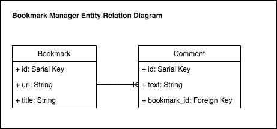

# Bookmark Manager

[Project Description](#project-description) | [Tech Stack](#tech-stack) | [Installation](#installation) | [Running tests](#running-tests) | [Development Process](#development-process) | [User Stories](#user-stories)

## Project Description

### By the end of the week all developers can:

- Build a simple web app with a database (this pirmary goal breaks down into the two sub-goals below)
- Follow an effective debugging process for database applications
- Explain the basics of how databases work (e.g. tables, SQL, basic relationships)

### Main focuses for this week

- Agile and TDD
- Engineering and 'Dev Recipes'
- Databases
- Tooling

This code is intended as a supplementary guide for bookmark manager.

The commits on master branch roughly correspond with the walkthroughs provided in the challenge.

## Tech Stack:

- [RSpec](https://rspec.info/) Behaviour Driven.
  Development for Ruby. **TDD**.
- [Sinatra](http://sinatrarb.com/) Sinatra is a DSL for quickly creating web. applications in Ruby with minimal effort.

## Installation

- Clone this repository
  `$ git clone https://github.com/EdAncerys/bookmark-manager`
- Navigate to local repository
  `$ cd bookmark-manager`
- Install bundler if you don't already have it
  `$ gem bundle install`
- Install all dependencies
  `$ bundle install`
- Start the server
  `$ ruby app.rb`
- Navigate to [http://localhost:4567](http://localhost:4567) in your browser

## Running tests

- Navigate to local repository
  `$ cd bookmark-manager`
- No need to start the server. In the terminal type the following command:
  `$ rspec`

#### To set up the database

Connect to `psql` and create the `bookmark_manager` and `bookmark_manager_test` databases:

```
CREATE DATABASE bookmark_manager;
CREATE DATABASE bookmark_manager_test;
```

To set up the appropriate tables, connect to each database in `psql` and run the SQL scripts in the `db/migrations` folder in the given order.

To run the Bookmark Manager app:

```
rackup -p 3000
```

- Navigate to [http://localhost:3000](http://localhost:3000) in your browser to view bookmarks

#### To see test coverage:

```
rubocop
```

## Development Process

While pairing in groupe we been following XP principles and values - all features were pair programmed, the team used test-driven development.

During pair up sessions we used an agile process of git branches, merges, regular code refactor and reviews.

### User Stories

```
As a time-pressed user
So that I can quickly go to web sites I regularly visit
I would like to see a list of bookmarks
```

```
As a user
So I can store bookmark data for later retrieval
I want to add a bookmark to Bookmark Manager
```

```
As a user
So that I can keep my bookmarks relevant
I want to delete a bookmark
```

```
As a user
So that I can keep my bookmarks up to date
I want to edit a bookmark
```

```
As a user
So that the bookmarks I save are useful
I want to only save a valid URL
```

```
As a user
So that I can make interesting notes
I want to add a Comment to a Bookmark
```

### Domain Model

Below is a domain model for the bookmarks model.

<p align="center">
      
    *Bookmark Manager domain model* 
</p>

### Entity Relationship Diagram

The below diagram indicates that:

- A Bookmark has many Comments
- A Comment belongs to a Bookmark

<p align="center">
      
    *Entity Relationship Diagram* 
</p>
